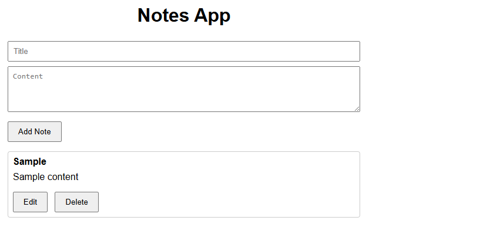

## 🔗 Live Demo

👉 [Click here to use the Notes App](https://summer-internship-2.onrender.com)


# summer-internship-
notes app
# Notes App 📝

A full-featured Notes Application with:

- ✅ Command Line Interface (CLI)
- ✅ RESTful API using Express
- ✅ Web-based UI (HTML + JS)
- ✅ Notes stored in `notes.json`

---

## 🚀 Features

- Add, view, list, delete notes via CLI
- CRUD operations via REST API
- Intuitive Web UI to manage notes

---

## 📁 Project Structure

├── cli.js # CLI interface
├── server.js # Express server with API + Static hosting
├── notes.js # Note logic (CRUD + JSON persistence)
├── index.html # Frontend UI
├── notes.json # Data storage
├── package-lock.json # NPM lockfile
└── node_modules/ # Installed dependencies


---

## 🧑‍💻 CLI Usage

```bash
node cli.js add "Title" "Content"
node cli.js list
node cli.js view <id>
node cli.js delete <id>

🌐 API Endpoints
Method	Endpoint	   Description
GET	    /notes	Get  all notes
GET	    /notes/:id	 Get single note
POST	  /notes	Add  a new note
PUT 	  /notes/:id	 Update a note
DELETE	/notes/:id	 Delete a note


🖥️ Web UI
Open http://localhost:3000 after running the server. You can:

Create new notes

Edit and delete existing ones

Demo 



